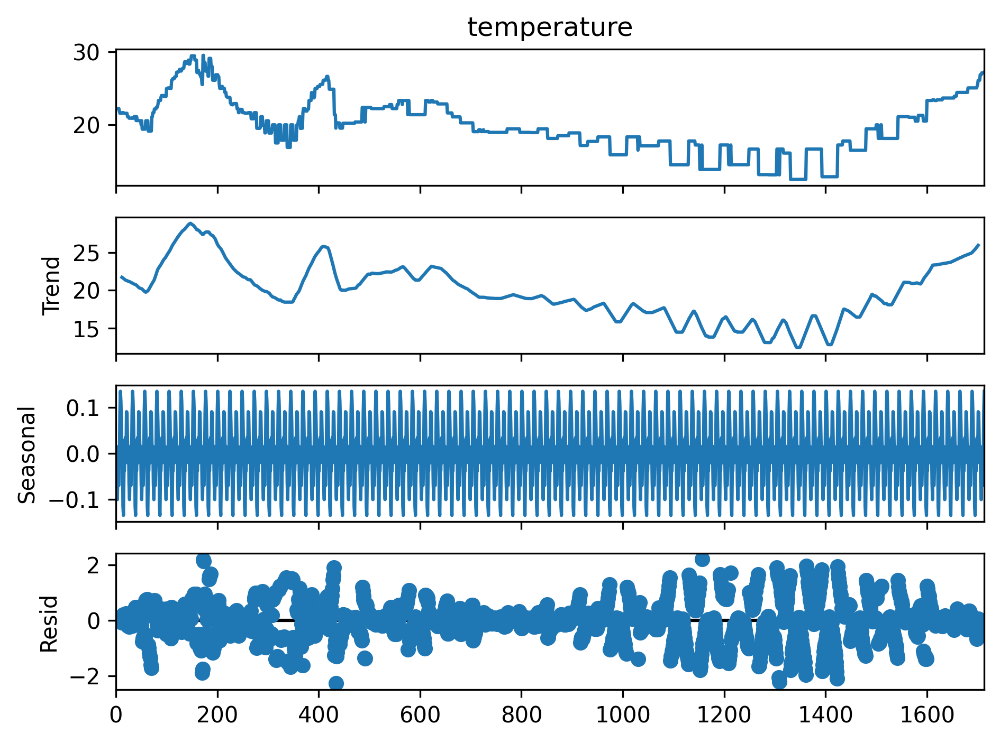

# Weather Data Collection, Processing, and Prediction

## Overview
This project is designed to collect real-time weather data, process it, visualize various aspects of the data, and use machine learning models (specifically LSTM) to predict future weather conditions. The project leverages data from the OpenWeatherMap API, stores it in an InfluxDB database, and generates a series of visualizations using Python's Matplotlib and Seaborn libraries. Additionally, it includes a machine learning model to predict temperature based on historical data.

## Features
- **Real-time Data Collection**: Fetches current weather data including temperature, humidity, and wind speed/direction from the OpenWeatherMap API.
- **Data Validation**: Utilizes Pydantic models to ensure the integrity and validity of the collected data.
- **Outlier Detection**: Detects outliers using Z-Score and Interquartile Range (IQR) methods to identify any anomalous data points.
- **Missing Data Imputation**: Uses K-Nearest Neighbors (KNN) to impute missing values, ensuring the dataset remains complete for analysis.
- **InfluxDB Integration**: Stores the processed weather data into an InfluxDB database for efficient time-series data storage and retrieval.
- **CSV Export**: Regularly exports the weather data to a CSV file, converting timestamps to the 'Europe/Istanbul' timezone and rounding to the nearest 5 minutes.
- **Data Visualization**: A variety of graphs are generated to visualize the trends and patterns in the weather data over time, including temperature, humidity, wind speed, and more.
- **Temperature Prediction**: Uses a Bidirectional LSTM model to predict future temperature values based on historical data.

## Data Visualization
The following graphs are generated based on the collected weather data:

### Temperature Over Time

This graph shows how the temperature changes over time. The x-axis represents the time, and the y-axis represents the temperature in degrees Celsius.

### Feels Like Temperature Over Time

This graph depicts the 'feels like' temperature, which factors in humidity and wind speed, giving a more accurate representation of how the temperature feels.

### Humidity Over Time

This graph shows the humidity levels over time, providing insights into how the moisture content in the air changes.

### Wind Speed Over Time

This graph shows the wind speed over time, highlighting periods of higher and lower wind activity.

### Combined Trends Over Time

This graph combines temperature, humidity, wind speed, and feels like temperature into one graph to show how these different metrics change in relation to each other over time.

### Temperature Seasonal Decomposition

This graph shows the decomposition of temperature data into trend, seasonal, and residual components to understand underlying patterns.

### Temperature Heatmap

This heatmap provides a visual representation of temperature data throughout the day, with hours of the day on the y-axis and dates on the x-axis.

## Prediction Model
In addition to visualizing the collected data, a machine learning model is used to predict future temperature values based on historical data.

### Prediction Model Details
- **Model Type**: Bidirectional LSTM
- **Input Data**: Historical temperature data, normalized
- **Layers**:
  - Input layer with a window size of 20
  - Two Bidirectional LSTM layers
  - Dense layers with LeakyReLU activation
  - Output layer with linear activation for regression
- **Training**: The model is trained with 70% of the data, validated with 15%, and tested with the remaining 15%.
- **Evaluation**: The model's performance is evaluated using R² Score and Mean Squared Error (MSE).

## Prediction Visualizations

### Training Data Predictions vs Actuals

This graph compares the model's predictions on the training data with the actual values.

### Validation Data Predictions vs Actuals

This graph compares the model's predictions on the validation data with the actual values.

### Test Data Predictions vs Actuals

This graph compares the model's predictions on the test data with the actual values.

### Test Data Predictions vs Actuals (Original Scale)

This graph shows the predictions and actual values on the test data in the original temperature scale.

### Training and Validation Metrics

#### Loss Over Epochs

This graph shows the training and validation loss over epochs, helping to monitor overfitting.

#### RMSE Over Epochs

This graph shows the Root Mean Squared Error (RMSE) over epochs for both training and validation datasets.

## Results
The final model was evaluated on the test set, and the results are as follows:

- **R² Score**: 0.9737912283600086
- **Mean Squared Error**: 0.0003676555419552269

These results indicate that the model has a strong predictive performance.

## Setup and Usage
To use this project, follow these steps:

### Install Dependencies
Ensure all necessary Python packages are installed:
```bash
pip install requests pydantic numpy influxdb-client pytz pandas scikit-learn matplotlib seaborn statsmodels tensorflow
